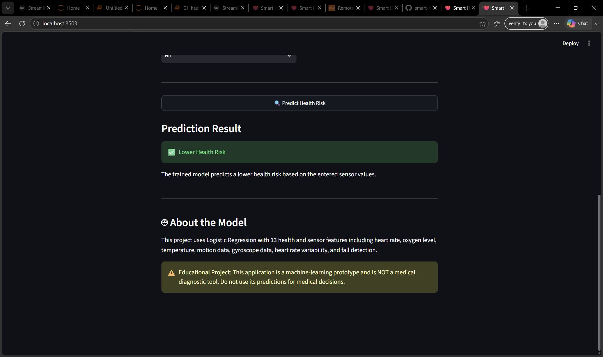

# Smart Health Risk Prediction

A machine learning project that predicts health risk using health monitoring and motion sensor data.

## Project Overview

The Smart Health Risk Prediction system uses machine learning to analyze health and sensor parameters such as:

* Heart rate
* Oxygen level
* Temperature
* Heart rate variability
* Accelerometer data
* Gyroscope data
* Fall detection

A **Logistic Regression** model is used to classify the input into two categories:

* Lower Health Risk
* Higher Health Risk

The project also includes a **Streamlit web application** that allows users to enter health parameters and receive a risk prediction.

> **Note:** The current dataset is simulated/testing data. The model's accuracy should not be interpreted as real-world medical performance.

## Features

* Heart rate monitoring
* Oxygen level monitoring
* Temperature monitoring
* Heart rate variability analysis
* Accelerometer data analysis
* Gyroscope data analysis
* Fall detection
* Machine learning health-risk prediction
* Interactive Streamlit application
* Model evaluation using Jupyter notebooks

## Technologies Used

* Python
* Pandas
* NumPy
* Scikit-learn
* Streamlit
* Matplotlib
* Jupyter Notebook
* Git & GitHub
* ESP32 integration planned

## Machine Learning

The project uses **Logistic Regression** for binary health-risk classification.

### Input Parameters

The model can work with health and sensor-related parameters such as:

* Heart rate
* Oxygen level
* Temperature
* Heart rate variability
* Motion/accelerometer values
* Gyroscope values
* Fall detection

### Output

The model predicts:

```text
Lower Health Risk
```

or

```text
Higher Health Risk
```

## Project Structure

```text
smart-health-risk-prediction
│
├── app
│   └── app.py
│
├── data
│   ├── health_data.csv
│   └── Health Monitoring and Fall detection dataset.csv
│
├── esp32
│   └── health_monitor.ino
│
├── model
│   └── health_risk_model.pkl
│
├── notebooks
│   ├── 01_health_risk_model.ipynb
│   ├── 02_new_dataset_exploration.ipynb
│   └── model_evaluation.ipynb
│
├── screenshots
│   └── streamlit_app.png
│
├── src
│   ├── predict.py
│   └── train_model.py
│
├── .gitignore
├── README.md
└── requirements.txt
```

## Streamlit Application

The project includes a Streamlit interface for interactive health-risk prediction.

### Screenshot



## How to Run

### 1. Clone the repository

```bash
git clone https://github.com/Vinaykumar-bethu/smart-health-risk-prediction.git
```

### 2. Open the project

```bash
cd smart-health-risk-prediction
```

### 3. Install dependencies

```bash
pip install -r requirements.txt
```

### 4. Run the Streamlit application

```bash
streamlit run app/app.py
```

The application will open in your browser.

## Model Training

The model-training code is available in:

```text
src/train_model.py
```

The trained model is saved as:

```text
model/health_risk_model.pkl
```

## Future Improvements

* Connect ESP32 to real sensors
* Collect real-time health data
* Add real-time sensor monitoring
* Improve model validation using real datasets
* Add more machine learning models
* Add live health dashboards
* Add database integration
* Deploy the Streamlit application online
* Add alerts for high-risk conditions

## Disclaimer

This project is developed for **educational and portfolio purposes**. It is not a medical diagnostic system and should not be used for medical decisions.

## Author

**Vinay Kumar Bethu**

B.Tech Artificial Intelligence & Machine Learning Student

GitHub: [Vinaykumar-bethu](https://github.com/Vinaykumar-bethu)

