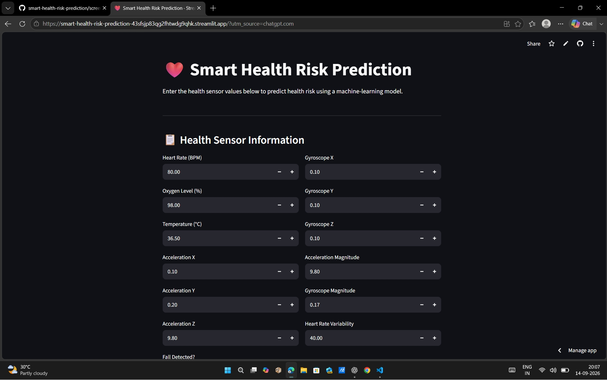
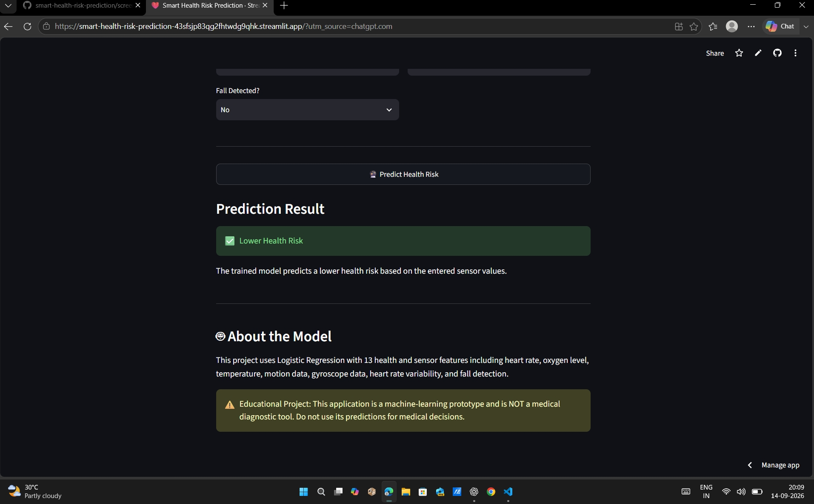
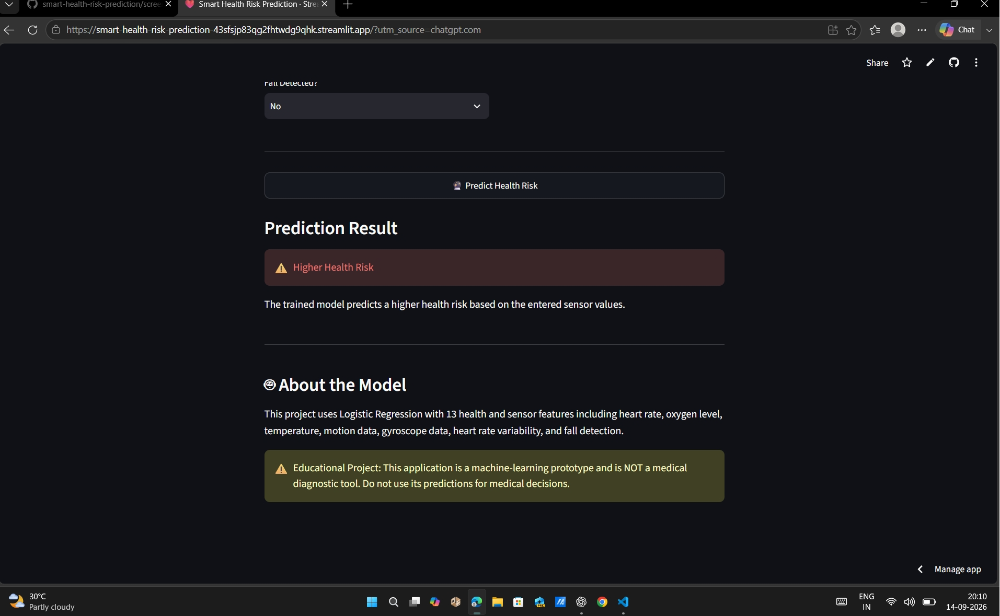

# 🩺 Smart Health Risk Prediction System

An AI/ML-based health risk prediction system that predicts potential health risk using health parameters and provides an easy-to-use Streamlit web interface.

## 🚀 Live Demo

👉 **Try the application:**
https://smart-health-risk-prediction-43sfsjp83qg2fhtwdg9qhk.streamlit.app/

---

## 📌 Project Overview

The **Smart Health Risk Prediction System** is a machine learning project designed to demonstrate how health-related parameters can be used to predict potential health risk.

The project combines:

* 🤖 Machine Learning
* 🐍 Python
* 🌐 Streamlit
* 📊 Logistic Regression
* 🔌 ESP32-based health monitoring concept

Users can enter health parameters through the web application and receive a predicted risk result.

---

## ✨ Features

* ❤️ Heart rate input
* 🌡️ Temperature input
* 🩸 Health parameter analysis
* 🤖 Machine Learning prediction
* 📊 Risk classification
* 🌐 Interactive Streamlit interface
* 🔌 ESP32 integration concept
* 📱 Simple and user-friendly interface

---

## 🧠 Machine Learning

### Algorithm Used

**Logistic Regression**

The model performs binary classification:

* 🟢 Lower Risk
* 🔴 Higher Risk

The trained model is saved as:

```text
model/health_risk_model.pkl
```

### ML Workflow

```text
Health Parameters
       ↓
Data Processing
       ↓
Machine Learning Model
       ↓
Logistic Regression
       ↓
Risk Prediction
       ↓
Streamlit Web Application
```

---

## 📸 Application Screenshots

### 🏠 Home Screen



### 🟢 Lower Risk Prediction



### 🔴 Higher Risk Prediction



---

## 🏗️ Project Structure

```text
smart-health-risk-prediction/
│
├── app/
│   └── app.py
│
├── data/
│
├── esp32/
│
├── model/
│   └── health_risk_model.pkl
│
├── notebooks/
│
├── screenshots/
│   ├── 01_home.png
│   ├── 02_lower_risk.png
│   └── 03_higher_risk.png
│
├── src/
│   ├── predict.py
│   └── train_model.py
│
├── requirements.txt
└── README.md
```

---

## 🔧 Technologies Used

| Technology          | Purpose                      |
| ------------------- | ---------------------------- |
| Python              | Programming                  |
| Pandas              | Data processing              |
| NumPy               | Numerical operations         |
| Scikit-learn        | Machine Learning             |
| Logistic Regression | Risk classification          |
| Streamlit           | Web application              |
| ESP32               | Hardware integration concept |
| Git & GitHub        | Version control              |

---

## 💻 Run the Project Locally

### 1. Clone the repository

```bash
git clone https://github.com/Vinaykumar-bethu/smart-health-risk-prediction.git
```

### 2. Open the project

```bash
cd smart-health-risk-prediction
```

### 3. Install dependencies

```bash
pip install -r requirements.txt
```

### 4. Run the Streamlit application

```bash
streamlit run app/app.py
```

The application will open in your browser.

---

## 🤖 Model Training

The machine learning model can be trained using:

```text
src/train_model.py
```

The trained model is stored inside:

```text
model/health_risk_model.pkl
```

---

## 🔌 Hardware Integration

The project is designed with an ESP32-based health monitoring concept.

Potential sensors include:

* ❤️ Pulse/Heart Rate Sensor
* 🌡️ Temperature Sensor
* 🔌 ESP32 Microcontroller

The sensor data can be collected and passed to the machine learning system for health-risk prediction.

---

## 🔮 Future Improvements

* Real-time ESP32 sensor data
* More health parameters
* Larger real-world dataset
* Improved model accuracy
* Multiple ML model comparison
* Health monitoring dashboard
* Historical prediction tracking
* Cloud database integration
* Mobile application
* Explainable AI predictions

---

## ⚠️ Disclaimer

This project is developed for **educational and demonstration purposes only**.

The predictions generated by this application should **not be considered medical advice or a medical diagnosis**.

---

## 👨‍💻 Author

**Vinay Kumar Bethu**

B.Tech — Artificial Intelligence & Machine Learning

GitHub:
https://github.com/Vinaykumar-bethu

---

⭐ If you found this project interesting, consider giving the repository a star!
